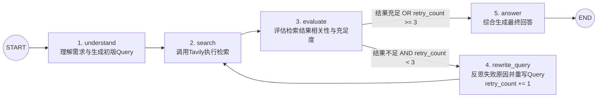
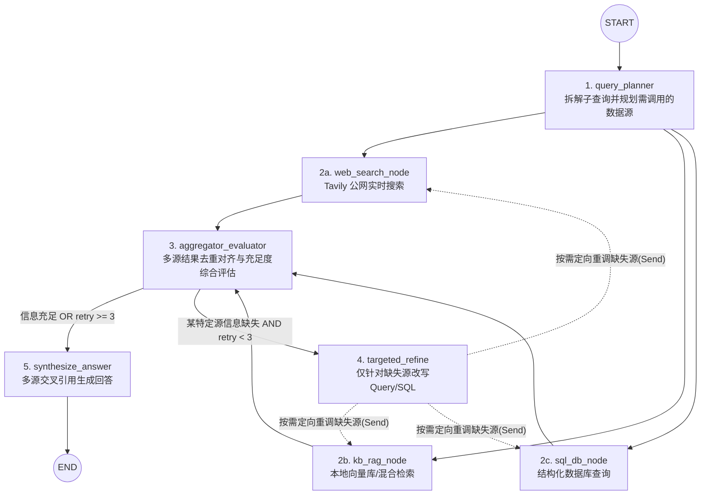
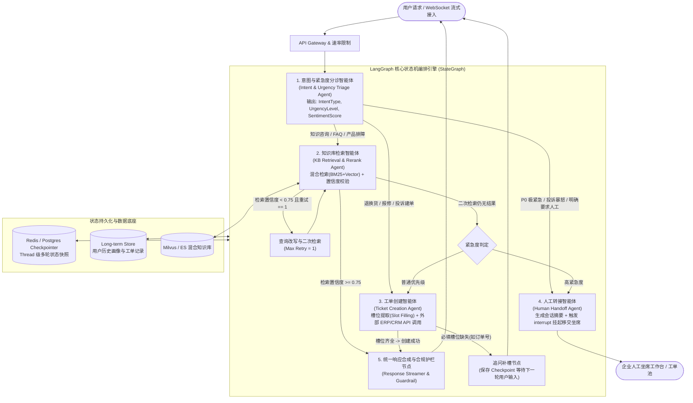

## AutoGen


## AgentScope


## LangGraph


---

# 第六章 框架开发实践 · 习题解答

## 习题 1 · 四大智能体框架多维对比与“涌现式协作 vs 显式控制”设计哲学

> **题目**：本章介绍了四个各具特色的智能体框架：`AutoGen`、`AgentScope`、`CAMEL` 和 `LangGraph`。请分析：
> - 在6.1.2节的表6.1中，对比了这四个框架的多个维度。请选择其中两个你最熟悉的框架，从"协作模式"、"控制方式"、"适用场景"三个维度进一步深入对比。
> - 本章提到了"涌现式协作"与"显式控制"之间的权衡，如何理解这两种设计哲学的含义。

---

### 1.1 四大框架全景基线与 `AutoGen` vs `LangGraph` 三维深度对比

在教材 6.1.2 节表 6.1 的基础上，四大主流智能体框架的核心架构基线如下表所示：

| 对比维度 | **AutoGen (v0.4+)** | **AgentScope** | **CAMEL** | **LangGraph** |
| :--- | :--- | :--- | :--- | :--- |
| **核心抽象** | 对话式智能体与群聊团队（`GroupChat`） | 消息驱动与生命周期管道（`MsgHub` / `Pipeline`） | 双角色扮演会话（`RolePlaying`）与团队（`Workforce`） | 有向图状态机（`StateGraph`：State + Nodes + Edges） |
| **通信机制** | 共享群聊上下文广播与发言人路由 | 显式异步消息传递（`Msg`）与结构化约束 | 点对点指令-执行交替对话（User $\leftrightarrow$ Assistant） | 集中式类型化共享状态字典（`TypedDict` + Reducer） |
| **工程侧重** | 快速敏捷原型、多角色对话协同 | 分布式部署、高并发容错、强结构化输出 | 提示词引导自主协作、合成数据生成与学术研究 | 确定性工作流编排、循环迭代控制、检查点持久化 |

以下选取代表**对话驱动范式**的 **`AutoGen`** 与代表**图状态机范式**的 **`LangGraph`**，从**协作模式**、**控制方式**、**适用场景**三个维度展开深度剖析：

#### （1）协作模式（Collaboration Paradigm）
- **`AutoGen`：去中心化的“群聊社会模拟（Conversational GroupChat）”**
  - **交互隐喻**：将多智能体系统抽象为“人类圆桌会议”。所有智能体（如 `AssistantAgent`、`UserProxyAgent`）挂载于同一个群聊容器（`RoundRobinGroupChat` 或 `SelectorGroupChat`），通过向共享消息历史追加自然语言消息完成协作。
  - **信息流转**：默认采用**广播共享上下文（Shared Thread）**，每个被唤醒的智能体均能观测到此前其他角色的完整对话记录，通过自然语言上下文理解前序产出（如需求文档、代码片段或报错堆栈）并生成下一步响应。
- **`LangGraph`：中心化的“共享黑板与有向状态流转（State-Centric Graph）”**
  - **交互隐喻**：将智能体系统抽象为“工业流水线与有限状态机（FSM）”。系统核心不再是“角色之间的聊天”，而是全局唯一、强类型的状态结构（如继承自 `TypedDict` 的 `SearchState`）。
  - **信息流转**：每个节点（Node）本质上是一个纯函数或 Runnable（输入当前 `State`，返回局部状态增量 `dict`）。节点之间无需全部暴露冗余的自然语言寒暄，而是通过读写特定状态字段（如 `search_query`、`search_results`、`step`）以及自定义归约器（如 `Annotated[list, add_messages]`）实现精确的数据交接。

#### （2）控制方式（Control Mechanism）
- **`AutoGen`：软性提示词约束 + 发言人选择器（Soft Control & Speaker Selection）**
  - **路由机制**：由群聊管理器（GroupChat Manager）决定下一位发言者。在 `RoundRobinGroupChat` 中按注册顺序轮询；在 `SelectorGroupChat` 中由一个轻量级路由 LLM 根据对话历史动态挑选中标角色，或辅以 `speaker_transitions_dict` 限制合法跳转集合。
  - **终止条件**：依赖组合式终止条件（如 `TextMentionTermination("TERMINATE")`、`MaxMessageTermination(n)`）。流转决策高度依赖模型是否严格遵循 `System Message` 中的尾缀暗号（如“完成后请说请工程师开始编写”），属于**概率性软控制**。
- **`LangGraph`：硬性拓扑边 + 确定性条件路由函数（Hard Graph Topology & Conditional Edges）**
  - **路由机制**：系统的控制流与 LLM 的文本生成彻底解耦。普通边（`add_edge`）强制固定执行顺序；条件边（`add_conditional_edges`）通过纯 Python 路由函数检查 `State` 中的结构化字段（如判断评分 `score >= 0.8` 或重试次数 `retry_count < 3`），100% 确定性地映射至下一个目标节点或 `END`。
  - **状态与中断控制**：内置编译期检查点（`Checkpointer`，如 `InMemorySaver` / `PostgresSaver`），支持在任意节点前后设置断点（`interrupt_before` / `interrupt_after`），实现时间旅行（Time Travel）、状态回滚与人工审批介入（Human-in-the-Loop）。

#### （3）适用场景（Applicable Scenarios）
- **`AutoGen` 适用场景**：
  1. **开放式探索与创意头脑风暴**：任务边界模糊、无法预先穷举标准作业程序（SOP），需要多视角碰撞（如产品策划、多学科方案研讨）。
  2. **敏捷原型验证与代码生成沙盒**：角色分工天然契合人类组织架构（PM $\rightarrow$ Dev $\rightarrow$ Reviewer），配合内置 Docker/本地代码执行器可快速搭建闭环原型。
- **`LangGraph` 适用场景**：
  1. **高可靠生产级业务流水线**：对延迟、Token 成本、输出合规性有严苛 SLA 要求的企业级应用（如金融风控审批、医疗分诊、多跳自适应 RAG）。
  2. **包含精密循环、分支回退与长周期持久化的复杂系统**：如需要“检索-评估-重写查询-再检索”固定上限循环的 Agentic RAG，或跨天级等待人工经理审批后再恢复执行的工单系统。

---

### 1.2 “涌现式协作（Emergent Collaboration）”与“显式控制（Explicit Control）”的设计哲学权衡

教材 6.6 节指出的这两种范式，本质上反映了智能体系统工程中**“自治性（Autonomy）与确定性（Determinism）”**的根本张力：

1. **涌现式协作（Emergent Collaboration，以 `CAMEL`、`AutoGen` 为代表）**：
   - **哲学内核**：“**设定规则与人设，让智能体自己找路**”。开发者仅定义宏观目标（Task Prompt）与个体的身份职责（Role System Prompt），不硬编码中间交互步骤。任务拆解、质疑修正与知识互补完全在多轮自然语言交互中**自发涌现**。
   - **核心优势**：**高上限与泛化能力强**。面对从未见过的长尾复杂问题，智能体能够动态协商出开发者未曾预设的解决路径，开发初期编码成本极低。
   - **核心代价**：**高方差与工程失控风险**。容易出现角色错位（Role Flipping）、死循环客套、上下文雪崩导致 Token 消耗失控，以及自然语言交接中的信息损耗，难以直接满足严肃生产环境的确定性要求。

2. **显式控制（Explicit Control，以 `LangGraph`、`AgentScope` 的 Pipeline/结构化输出为代表）**：
   - **哲学内核**：“**把 LLM 装进确定性的工程笼子里**”。开发者将领域专家的先验知识固化为有向图拓扑（StateGraph）、显式消息管道（Pipeline）或强类型 Pydantic Schema，LLM 仅作为受控的局部算子（推理节点或分类节点）在既定轨道上运行。
   - **核心优势**：**高下限、强可观测性与可审计性**。每一步状态变迁均有迹可循，异常分支有确定性兜底，成本与延迟可精确估算。
   - **核心代价**：**系统上限受限于开发者的流程设计能力**，图拓扑难以覆盖所有动态突发场景，前期架构设计与状态建模成本较高。

3. **工程演进趋势——走向“外层显式图控制 + 内层局部涌现”（分层混合架构）**：
   在现代生产实践中，二者并非非此即彼，而是呈现**宏观显式、微观涌现**的融合趋势：在系统顶层采用 `LangGraph` 或 `AgentScope` Pipeline 固化核心业务主干与合规红线（显式控制）；而在某个具体复杂节点内部（例如“方案创意构思”节点），挂载一个受最大轮次限制的 `AutoGen` 小型群聊或 `CAMEL` 双角色会话（局部涌现），从而兼顾工程确定性与创造力上限。

---

## 习题 2 · AutoGen 软件开发团队扩展：动态回退、QA 测试角色与对话质量监控

> **题目**：在6.2节的 `AutoGen` 案例中，我们构建了一个"软件开发团队"。请基于此案例进行扩展思考：
> - 当前的团队使用 `RoundRobinGroupChat`（轮询群聊）模式，智能体按固定顺序发言。如果需求变更，工程师的代码需要返回给产品经理重新审核，应该如何修改协作流程？请设计一个支持"动态回退"的机制。
> - 在案例中，我们通过 `System Message` 为每个智能体定义了角色和职责。请尝试为这个团队添加一个新角色"测试工程师"（`Quality Assurance`），并设计其系统消息，使其能够在代码审查后执行自动化测试。
> - `AutoGen` 的对话式协作存在可能的不稳定性，可能导致对话偏离主题或陷入循环。请思考：如何设计一套"对话质量监控"机制，在检测到异常时及时干预？

---

### 2.1 支持“动态回退”的协作流程改造设计

教材原案例使用 `RoundRobinGroupChat([product_manager, engineer, code_reviewer, user_proxy])`，其发言顺序被死锁为 $PM \rightarrow Engineer \rightarrow Reviewer \rightarrow UserProxy$ 的单向环，无法在发现“需求歧义”或“代码缺陷”时按需局部回退。

在 `autogen-agentchat` (v0.4+) 架构下，实现支持**动态回退（Dynamic Fallback）**的核心方案是：**将 `RoundRobinGroupChat` 替换为 `SelectorGroupChat`，并结合确定性路由函数 `selector_func` 与显式状态标记词（Routing Tags）**。

#### 状态流转拓扑设计
- **正向主链路**：`ProductManager` $\xrightarrow{\text{[ROUTE: ENGINEER]}}$ `Engineer` $\xrightarrow{\text{[ROUTE: REVIEWER]}}$ `CodeReviewer` $\xrightarrow{\text{[ROUTE: QA]}}$ `QualityAssurance` $\xrightarrow{\text{[ROUTE: USER\_PROXY]}}$ `UserProxy`。
- **三条动态回退链路**：
  1. **需求澄清回退（Engineer $\rightarrow$ ProductManager）**：工程师发现需求存在逻辑冲突或边界缺失时，输出 `[FALLBACK: PM_CLARIFY]`，直接回退给产品经理修订需求规格。
  2. **代码静态缺陷回退（CodeReviewer $\rightarrow$ Engineer / ProductManager）**：代码审查员发现实现 Bug 时输出 `[FALLBACK: FIX_CODE]` 回退给工程师；若发现代码偏离原始业务目标或需求本身需调整，输出 `[FALLBACK: PM_REAUDIT]` 回退给产品经理重新审核。
  3. **自动化测试失败回退（QualityAssurance $\rightarrow$ Engineer）**：QA 执行单元测试未通过时输出 `[FALLBACK: TEST_FAILED]`，附带报错堆栈打回工程师修复。

---

### 2.2 新增“测试工程师（Quality Assurance）”角色与 System Message 设计

测试工程师（`QualityAssurance`）位于 `CodeReviewer`（静态代码审查）之后、`UserProxy`（最终验收）之前，负责设计边界测试用例并通过工具执行自动化验证。

#### `QualityAssurance` 系统消息（System Message）与工具挂载实现
```python
from autogen_agentchat.agents import AssistantAgent

def create_quality_assurance(model_client):
    """创建测试工程师（QA）智能体"""
    system_message = """你是一位资深的软件测试工程师（Quality Assurance, QA），负责在代码审查通过后对软件进行严格的自动化测试与边界验证。

你的核心职责包括：
1. **测试用例设计**：基于产品经理的需求规格，设计覆盖正常路径（Happy Path）、边界值（Boundary Conditions）及异常输入（Negative Tests）的测试用例。
2. **静态与语法核验**：使用 AST 解析、编译检查及导入测试验证代码的完整性与可执行性。
3. **动态自动化测试**：对于算法/逻辑模块编写并运行 `pytest`/`unittest` 断言；对于 Streamlit/Web 应用，验证核心状态初始化、数据拉取函数异常处理及组件渲染逻辑。
4. **测试报告产出**：按固定结构输出《QA自动化测试报告》，包含：【用例列表】、【执行结果】、【覆盖率与异常分析】、【明确路由指令】。

路由指令规范（必须在回复末尾严格附带以下唯一标签）：
- 若所有核心测试与异常处理验证通过：在末尾输出 `[ROUTE: USER_PROXY]`，请用户代理进行最终验收。
- 若发现运行时异常、依赖缺失或未处理的边界崩溃：在末尾输出 `[FALLBACK: TEST_FAILED]`，要求工程师根据报错堆栈修复代码。
- 若发现代码行为与需求定义存在根本冲突：在末尾输出 `[FALLBACK: PM_REAUDIT]`，退回产品经理重新裁定需求。"""

    return AssistantAgent(
        name="QualityAssurance",
        model_client=model_client,
        system_message=system_message,
    )
```

---

### 2.3 “对话质量监控（Conversation Quality Monitor）”与异常干预机制

针对 `AutoGen` 对话式协作易出现的**乒乓死循环（Ping-Pong Loop）**、**重复生成（Repetitive Output）**、**角色越界（Role Drift）**和**主题偏离（Topic Drift）**四大顽疾，可设计一套由**三层防御拦截器**组成的对话质量监控体系：

1. **第一层：基于规则的乒乓循环与局部重试熔断器（Rule-based Circuit Breaker）**
   - 在 `selector_func` 中维护滑动窗口状态：统计最近 $K=6$ 条消息的角色转移序列。
   - **异常判定**：若检测到 `Engineer <-> CodeReviewer` 或 `Engineer <-> QualityAssurance` 连续往返回退超过 3 次（即同一 Bug 连续修改 3 次仍未通过），触发**升级干预（Escalation）**——强制将下一发言人切换为 `ProductManager` 简化需求方案，或切换至 `QualityMonitor`（监控仲裁智能体）输出收敛指令。
2. **第二层：基于语义相似度与协议校验的偏离检测（Semantic & Protocol Guardrail）**
   - **协议合规检查**：检查当前智能体发言是否包含 필수的结构化章节及合法的尾缀路由标签（如 `[ROUTE: ...]` 或 `[FALLBACK: ...]`）。若缺失标签，路由函数自动触发基于 LLM 的 fallback 分类器，并在系统日志中记录协议违约。
   - **重复度与偏离度检测**：计算相邻两轮同角色输出的文本 Jaccard / Embedding 余弦相似度。若相似度 $> 0.92$（陷入复读机状态），或者与初始用户任务 `task` 的语义相关度低于阈值，立即触发干预。
3. **第三层：组合式硬性终止底线（Composite Termination Safeguard）**
   - 使用 AutoGen 的组合终止算子（`|` 运算符）将业务完成标志与物理资源硬上限绑定：
     ```python
     termination = (
         TextMentionTermination("TERMINATE")
         | MaxMessageTermination(max_messages=25)
         | TimeoutTermination(timeout_seconds=300)
     )
     ```

#### 完整可运行代码实现（整合动态回退 + QA 角色 + 对话质量监控）

```python
import asyncio
from typing import Sequence
from autogen_agentchat.agents import AssistantAgent, UserProxyAgent
from autogen_agentchat.teams import SelectorGroupChat
from autogen_agentchat.conditions import TextMentionTermination, MaxMessageTermination
from autogen_agentchat.messages import AgentEvent, ChatMessage

def build_monitored_selector(max_ping_pong: int = 3):
    """构建带质量监控与动态回退的确定性发言人选择器"""
    fallback_counter = {"code_fix_loops": 0}

    def selector_func(messages: Sequence[AgentEvent | ChatMessage]) -> str | None:
        if not messages:
            return "ProductManager"

        last_msg = messages[-1]
        last_speaker = last_msg.source
        content = last_msg.content if isinstance(last_msg.content, str) else str(last_msg.content)

        # --- [监控层 1] 重复输出/复读机检测 ---
        same_speaker_msgs = [
            m.content for m in messages[:-1]
            if m.source == last_speaker and isinstance(m.content, str)
        ]
        if same_speaker_msgs and content.strip() == same_speaker_msgs[-1].strip():
            print("⚠️ [QualityMonitor] 检测到重复发言，强制升级至 ProductManager 重新收敛方案")
            return "ProductManager"

        # --- [监控层 2] 局部回退死循环熔断 ---
        if "[FALLBACK: FIX_CODE]" in content or "[FALLBACK: TEST_FAILED]" in content:
            fallback_counter["code_fix_loops"] += 1
            if fallback_counter["code_fix_loops"] > max_ping_pong:
                print(f"⚠️ [QualityMonitor] 代码修复回退已达上限({max_ping_pong}次)，强制回退 ProductManager 裁剪需求")
                fallback_counter["code_fix_loops"] = 0
                return "ProductManager"
            return "Engineer"

        # --- [路由层] 显式动态回退与正向流转解析 ---
        if "[FALLBACK: PM_CLARIFY]" in content or "[FALLBACK: PM_REAUDIT]" in content:
            return "ProductManager"
        if "[ROUTE: ENGINEER]" in content:
            return "Engineer"
        if "[ROUTE: REVIEWER]" in content:
            return "CodeReviewer"
        if "[ROUTE: QA]" in content:
            fallback_counter["code_fix_loops"] = 0  # 通过代码审查，重置计数
            return "QualityAssurance"
        if "[ROUTE: USER_PROXY]" in content:
            return "UserProxy"

        # --- [兜底策略] 当智能体遗漏路由标签时，交还 SelectorGroupChat 的默认模型路由 ---
        return None

    return selector_func
```

---

## 习题 3 · AgentScope 三国狼人杀进阶：新角色设计、双层融合架构与复杂状态流管理

> **题目**：在6.3节的 `AgentScope` 案例中，我们实现了一个"三国狼人杀"游戏。请基于此案例进行深入思考：
> - 如果要添加新的游戏角色（如"猎人"、"白痴"、"守卫"），需要修改哪些部分的代码？请设计其中一个角色的完整实现方案（包括提示词和结构化输出模型）。
> - 案例中将"游戏角色"（狼人、预言家等）和"三国人格"（刘备、曹操等）进行了融合设计。这种设计有什么优势？如果将这种思想应用到其他场景（如客服系统、教育辅导），应该如何设计？
> - 在6.3.1节中提到，`AgentScope` 通过消息驱动架构将"控制流"与"业务逻辑"解耦。请结合狼人杀案例中的具体代码，说明这种设计如何帮助管理复杂的游戏状态（如夜晚阶段、白天讨论、投票淘汰、技能触发等）。

---

### 3.1 新增游戏角色需要修改的代码模块与“守卫（Guard）”完整实现方案

#### （1）扩展新角色需修改的代码清单
结合 `code/chapter6/AgentScopeDemo/` 工程结构，新增“守卫”、“猎人”或“白痴”需联动修改以下 4 个核心文件：
1. **`game_roles.py`（角色配置与标准局阵营定义）**：在 `ROLES_INFO` 字典中注册新角色的名称、阵营（好人/神职）、技能描述、优先级与行动阶段；在 `get_standard_setup(player_count)` 中更新 7~12 人局的角色分配列表。
2. **`prompt_cn.py`（中文提示词模板）**：在 `ROLE_PROMPTS` 中新增该角色专属的底牌策略提示词，并在 `GAME_PROMPTS` 中补充主持人夜晚唤醒该角色或白天技能触发的指令模板。
3. **`structured_output_cn.py`（Pydantic 结构化输出模型）**：新增该角色技能结算专用的 `BaseModel` 子类（如 `GuardActionModelCN`、`HunterShootModelCN`），约束字段类型与合法范围。
4. **`main_cn.py`（主游戏状态机与结算引擎）**：在 `ThreeKingdomsWerewolfGame` 类中新增角色分组列表（如 `self.guards`），并在 `night_phase()` 或 `day_phase()` 中加入对应的技能问询与交叉结算逻辑（如“同守同救奶穿”或“猎人被毒无法开枪”）。

#### （2）“守卫（Guard）”完整代码实现方案

**① 结构化输出模型（`structured_output_cn.py`）**：
```python
from typing import Optional
from pydantic import BaseModel, Field

class GuardActionModelCN(BaseModel):
    """守卫夜晚守护行动的结构化输出模型"""
    protect_target: Optional[str] = Field(
        description="今晚选择守护的玩家姓名；若选择空守（不守护任何人），则填 None",
        default=None
    )
    is_self_protect: bool = Field(
        description="本次是否为守护自己（自守）",
        default=False
    )
    protection_reason: str = Field(
        description="结合场上局势、预言家/女巫暴露情况及上一晚守护记录，说明选择该守护目标的战术依据"
    )
```

**② 角色系统提示词与主持人问询模板（`prompt_cn.py`）**：
```python
GUARD_ROLE_PROMPT = """你本局的隐藏游戏身份是【守卫】（好人阵营·神职）。
【核心技能与规则约束】：
1. 每个夜晚你可以选择守护一名存活玩家（包括你自己），使其免受当晚狼人的袭击。
2. **禁连守规则**：你**绝对不能连续两个夜晚守护同一名玩家**（上一晚守护过的目标，今晚不可再守，但可以选择空守）。
3. **同守同救规则（奶穿）**：若你守护的目标恰好被狼人袭击，且女巫同时对其使用了灵药（解药），守卫的守护与女巫的解药将相互抵消，该玩家依然会死亡。
4. **白天发言策略**：切忌过早暴露守卫身份以免被狼人优先刀杀；重点倾听跳预言家和女巫的发言，暗中博弈狼人今晚的落刀点（守明神、自守或空守防同守同救）。
请始终以【{character}】的性格、语气和三国的谋略思维进行推理与发言。"""

GUARD_NIGHT_PROMPT = """【守卫行动阶段】守卫请睁眼。
当前存活玩家列表：{alive_players}
你上一晚守护的玩家是：{last_guarded}（注意：今晚不可再次守护该玩家！本轮合法守护候选为：{valid_targets}，或选择 None 空守）。
请分析今晚狼人最可能袭击的目标，做出你的守护决策。"""
```

**③ 夜晚结算引擎集成（`main_cn.py` 核心片段）**：
```python
async def guard_phase(self) -> Optional[str]:
    """守卫夜晚行动阶段"""
    if not self.guards:
        return None
    guard = self.guards[0]
    alive_names = [p.name for p in self.alive_players]
    valid_targets = [n for n in alive_names if n != self.last_guarded_player]

    prompt = GUARD_NIGHT_PROMPT.format(
        alive_players="、".join(alive_names),
        last_guarded=self.last_guarded_player or "无（首夜或上夜空守）",
        valid_targets="、".join(valid_targets),
    )
    response = await guard(
        Msg(name="Moderator", content=prompt, role="assistant"),
        structured_model=GuardActionModelCN,
    )
    target = response.metadata.get("protect_target")
    # 引擎侧硬性规则校验：防止模型违反“不得连守”或守护死人
    if target == self.last_guarded_player or (target and target not in alive_names):
        target = None
    self.last_guarded_player = target
    return target
```
在 `night_phase` 最终计算死亡名单时，将狼人击杀目标 `killed_player`、女巫解救状态 `witch_saved` 与守卫守护目标 `guarded_player` 联合判定：
- 若 `killed_player == guarded_player` 且 `not witch_saved`：守护成功，平安夜；
- 若 `killed_player == guarded_player` 且 `witch_saved`：触发**同守同救（奶穿）**，`killed_player` 依然出局。

---

### 3.2 “功能角色（Game Role）+ 人格特征（Persona）”双层融合架构的优势与跨领域迁移

#### （1）双层正交解耦设计的核心优势
案例中通过 `get_role_prompt(role, character)` 将**职责层（游戏规则、胜负目标、技能边界）**与**表现层（三国人物的性格、话术风格、风险偏好）**正交组合，具备三大工程优势：
1. **彻底打破同质化博弈（Diversity & Anti-Homogeneity）**：若所有智能体仅注入纯粹的“狼人/村民标准最优策略提示词”，底层同一 LLM 生成的发言会高度趋同、套路化。融入“曹操的生性多疑与权谋伪装”、“张飞的直率暴躁”、“诸葛亮的缜密归因”后，即使抽到相同的狼人底牌，不同角色也会涌现出截然不同的欺诈与抗推策略。
2. **組合爆炸式复用（$M \times N$ 正交扩展性）**：$M$ 种功能身份与 $N$ 种人物性格独立维护，无需编写 $M \times N$ 份耦合 Prompt，即可组合出海量差异化智能体实例。
3. **逻辑严谨性与角色沉浸感分离控制**：底层决策通过 `structured_model`（Pydantic）保障规则合法性，表层 `content` 文本则保留鲜明的三国文风，实现“内里守规矩、外在有灵魂”。

#### （2）向“智能客服系统”与“AI 教育辅导系统”的迁移设计

| 应用场景 | 第一层：功能职责层（Functional Role） | 第二层：人格风格层（Persona Layer） | 双层融合落地效果 |
| :--- | :--- | :--- | :--- |
| **智能客服系统** | **工单职责与权限边界**：<br>- `Tier1Reception`（一线分流与常规FAQ）<br>- `TechSupport`（故障排查与日志诊断）<br>- `RetentionSpecialist`（客诉安抚与退换货挽留）<br>- `ComplianceAuditor`（退款红线与合规核查） | **品牌调性与客群适配人格**：<br>- **潮玩/游戏品牌**：“热血店小二/次元伙伴”<br>- **高端私人银行**：“严谨温和的资深顾问”<br>- **暴躁/焦虑用户专属**：“高共情倾听者（先共情后给方案）” | 无论外在语气是活泼还是沉稳，底层的退款金额上限、工单字段提取（`TicketSchema`）和 SOP 升级规则 100% 严格受控。 |
| **AI 教育辅导** | **教学法角色（Pedagogical Role）**：<br>- `SocraticTutor`（苏格拉底式追问引导，禁直接给答案）<br>- `DiagnosticGrader`（错因归因与知识点定位）<br>- `PeerStudyBuddy`（伴学同桌，故意暴露常见误区引发讨论） | **名师风格与学段适配人格**：<br>- **小学启蒙段**：“探险家向导（故事化类比、高频正向激励）”<br>- **竞赛/考研冲刺段**：“严厉命题组教练（直击边界漏洞、高密度追问）” | 同一道算法题，对基础薄弱学生用“温和学长+苏格拉底渐进提示”，对冲刺高分学生用“严师教练+反例压力测试”，因材施教。 |

---

### 3.3 AgentScope 消息驱动架构如何实现“控制流”与“业务逻辑”解耦并管理复杂状态

在传统面向对象或硬编码脚本中，智能体内部往往塞满了 `if phase == "night": ... elif phase == "vote": ...` 的流程判断，导致角色代码与游戏主循环深度耦合。`AgentScope` 通过以下四大原语实现了**控制流（游戏引擎状态机）**与**业务逻辑（智能体推理与角色扮演）**的彻底解耦：

1. **统一接口契约（`AgentBase.reply` 与 `Msg` 信封）**：
   - 每个三国玩家均是标准的 `ReActAgent` 实例，其内部**完全不知道当前是第几夜、也不知道外部循环如何运转**，只负责接收一条 `Msg` 并根据自身上下文记忆与系统提示词返回一条 `Msg`。
   - 游戏主控制器（`ThreeKingdomsWerewolfGame`）独占“上帝视角控制流”，智能体独占“第一视角角色推理”，新增游戏阶段无需改动智能体类本身。
2. **基于 `MsgHub` 的动态信息视野隔离（Information Asymmetry Control）**：
   - 狼人杀最核心的状态难点是**视野隔离**（狼人夜晚频道仅狼人可见，预言家查验仅预言家可见，白天讨论全员可见）。
   - 代码中通过上下文管理器 `async with MsgHub(participants=...)` 动态构建临时广播域：
     - **夜晚狼人密谋**：`async with MsgHub(participants=self.werewolves) as wolves_hub:` —— 在此作用域内，一名狼人的发言会自动通过 `wolves_hub` 广播进其他狼人的记忆库，而好人玩家的记忆不受任何污染。
     - **白天公开发言**：`async with MsgHub(participants=self.alive_players) as day_hub:` —— 全员共享发言信息。
3. **声明式管道编排（`sequential_pipeline` 与 `fanout_pipeline`）**：
   - **顺序发言阶段**：使用 `await sequential_pipeline(agents=self.alive_players, msg=...)` 一行代码替代繁琐的 `for` 循环与上下文传递，自动按序流转讨论。
   - **并发独立决策阶段（投票/狼人首刀投票）**：使用 `await fanout_pipeline(agents=self.alive_players, msg=vote_prompt, enable_gather=True)`，将同一投票指令并发扇出给所有存活玩家，底层基于 `asyncio` 并行请求 LLM，既避免了后发言玩家受前人跟票影响，又将投票阶段耗时从 $O(N \cdot T)$ 压缩至 $O(T)$。
4. **调用时动态注入 `structured_model`（协议与自然语言解耦）**：
   - 同一个智能体在不同阶段被调用时，主控流按需传入不同的 Pydantic 模型：讨论阶段传 `DiscussionModelCN`，投票阶段传 `VoteModelCN`，女巫阶段传 `WitchActionModelCN`。智能体自动在保持三国自然语言发言（`msg.content`）的同时，在 `msg.metadata` 中产出 100% 符合引擎结算要求的结构化字段，彻底消除了正则表达式解析失败导致的状态机崩溃。

---

## 习题 4 · CAMEL 角色扮演深入剖析与 Workforce 多智能体架构演进

> **题目**：在6.4节的 `CAMEL` 案例中，两个智能体通过角色扮演协作完成了电子书写作。请分析：
> - 在这个案例中，没有显式的流程控制代码，完全依靠智能体的自主交互推进任务。请结合代码分析，**任务具体化**（`Task Specifier`）和**系统提示词设计**在其中起到了什么关键作用？
> - 6.4.1节提到了 `CAMEL` 的 `Workforce` 功能，它可以组织多个智能体协同工作。请查阅 `CAMEL` 官方文档，了解 `Workforce` 的设计原理，并思考如何用它重构6.2节的"软件开发团队"案例。

---

### 4.1 无显式控制代码下，“任务具体化（Task Specifier）”与“双向系统提示词（Inception Prompting）”的核心作用

在 `code/chapter6/CAMEL/DigitalBookWriting.py` 中，外部主循环仅有短短十余行：
```python
input_msg = role_play_session.init_chat()
while n < chat_turn_limit:
    assistant_response, user_response = role_play_session.step(input_msg)
    if "CAMEL_TASK_DONE" in user_response.msg.content:
        break
    input_msg = assistant_response.msg
```
在完全没有 `if-else` 分支或状态图的情况下，两个 LLM 之所以不会陷入无意义的寒暄、跑题或互相等候，完全归功于 `RolePlaying` 内部封装的两大核心机制：

#### （1）任务具体化（`Task Specifier`）—— 消除初始模糊性，锚定收敛边界
- **底层机制**：当 `RolePlaying(..., with_task_specify=True)` 开启时，一个专门的 `TaskSpecifierAgent` 会在正式对话启动前介入，将人类输入的一句话笼统目标（例如“写一本关于拖延症的书”）扩写为一份包含**具体目录结构、目标字数、理论框架、实操案例要求及交付标准**的高密度任务契约（Specified Task）。（注：在 6.4 节案例代码中，作者直接在 `task_prompt` 字符串里手工编写了长达 20 行的结构化大纲与数据要求，并将 `with_task_specify` 设为 `False`，本质上是人工执行了 `Task Specifier` 的职责）。
- **关键作用**：为后续几十轮的自主交互提供了**全局唯一的评估基准（Ground Truth Anchor）**。若缺少这一步，`AI User`（作家）将不知道该分几步发号施令，也不知道何时才算“全部写完”，极易在 2~3 轮内草草结束或无限发散。

#### （2）双向系统提示词设计（`Inception Prompting`）—— 确立不对称主从契约与推进引擎
`CAMEL` 在 `RolePlaying` 初始化时，基于 `assistant_role_name="心理学家"` 和 `user_role_name="作家"` 自动渲染了两份严格对称互补的元系统提示词（Meta System Prompts）：
1. **强制主从职责隔离（防角色翻转 Role Flipping）**：
   - 给 **AI User（作家）** 注入刚性规则：“*你必须始终扮演作家向心理学家下达指令，绝不能自己代替心理学家回答专业内容，每次只能提出一个明确的子任务指令（`Instruction: ...`）*”。
   - 给 **AI Assistant（心理学家）** 注入刚性规则：“*你必须服从作家的指令并提供具体的解决方案（`Solution: ...`），绝不能反客为主向作家发号施令或拒绝执行*”。
2. **微步迭代推进机制（Step-by-Step Decomposition）**：
   - 系统提示词强制要求 `AI User` 根据 `task_prompt` 的总目录，结合上一轮 `AI Assistant` 的产出质量，自主决定是“要求补充修改当前章节”还是“推进到下一章节指令”，从而将隐式的状态推进器编码进了 `AI User` 的每一次推理中。
3. **确定性停机暗号（`<CAMEL_TASK_DONE>`）**：
   - 系统提示词明确规定：唯有当 `AI User` 核对 `task_prompt` 中的所有章节与要求均已逐一交付完毕时，才允许且必须输出 `<CAMEL_TASK_DONE>` 标识符，从而触发外层 Python `while` 循环的安全退出。

---

### 4.2 CAMEL `Workforce` 的架构设计原理与重构 6.2 节“软件开发团队”

#### （1）`CAMEL Workforce` 核心设计原理
经典的 `RolePlaying` 仅支持 **1v1 双智能体点对点交互**，难以直接扩展到 4 人以上的复杂组织。为此，`CAMEL`（`camel.societies.workforce`）引入了 **`Workforce`（层级化任务驱动工作组）** 架构，其核心设计包含三大支柱：
1. **双核心内置调度器（Coordinator Agent + Task Planner Agent）**：
   - **`Task Planner Agent`（任务规划器）**：接收用户的顶层复杂任务（`camel.tasks.Task`），将其动态分解为一组带先后依赖关系的子任务树（Sub-tasks），并在执行失败时动态重新拆解（Re-plan）。
   - **`Coordinator Agent`（协调分发器）**：维护工作组内所有工作节点（Worker Nodes）的职责画像（Description），根据每个子任务的属性，将其动态指派（Assign）给最匹配的 Worker 节点。
2. **多样化可嵌套工作节点（Composable Worker Nodes）**：
   - `Workforce` 采用组合模式（Composite Pattern），支持挂载三种异构工作节点：
     - `SingleAgentWorker`：由单个 `ChatAgent`（可挂载工具集如代码执行器、搜索工具）组成的独立专家节点；
     - `RolePlayingWorker`：将一个完整的 `RolePlaying` 双人协作组封装为单个节点，用于攻克高难度创意或结对子任务；
     - 子 `Workforce` 节点：支持多层树状嵌套。
3. **异步共享任务通道（Shared Task Channel）与容错重派**：
   - 节点之间不再像 `AutoGen` 那样在同一个群聊里全员广播闲聊，而是通过**共享任务队列/黑板**认领各自被分配的 `Task`，完成后将结果写回 `Task.result` 并作为下游依赖子任务的上下文，天然具备**失敗自动重试、任务进一步拆解或动态创建新专家节点**的自愈能力。

#### （2）使用 `CAMEL Workforce` 重构 6.2 节“比特币价格看板软件开发团队”
我们将原本扁平轮询的 4 个角色重构为由 `Workforce` 统一编排的专业化工作节点（其中“需求与架构评审”可采用双角色节点，“编码与审查”、“测试验收”采用单智能体工具节点）：

```python
from camel.agents import ChatAgent
from camel.messages import BaseMessage
from camel.models import ModelFactory
from camel.societies.workforce import Workforce
from camel.tasks import Task
from camel.toolkits import CodeExecutionToolkit
from camel.types import ModelPlatformType

def build_camel_software_workforce():
    # 1. 初始化统一底层大模型
    model = ModelFactory.create(
        model_platform=ModelPlatformType.OPENAI_COMPATIBLE_MODEL,
        model_type="deepseek-chat",
    )

    # 2. 定义各专业领域的 ChatAgent
    pm_agent = ChatAgent(
        system_message=BaseMessage.make_assistant_message(
            role_name="产品经理",
            content="负责需求分析、UI模块拆解、CoinGecko API接口定义与验收标准制定。"
        ),
        model=model,
    )

    engineer_agent = ChatAgent(
        system_message=BaseMessage.make_assistant_message(
            role_name="全栈工程师",
            content="精通 Python 与 Streamlit，负责根据产品规格编写完整可运行的 app.py 代码，包含异常处理与缓存机制。"
        ),
        model=model,
    )

    reviewer_qa_agent = ChatAgent(
        system_message=BaseMessage.make_assistant_message(
            role_name="代码审查与测试专家",
            content="负责审查代码规范、安全性与异常处理，并调用代码执行工具验证语法与核心数据拉取逻辑。"
        ),
        model=model,
        tools=CodeExecutionToolkit(sandbox="subprocess").get_tools(),
    )

    # 3. 构建 Workforce 并注册异构 Worker 节点
    workforce = Workforce(
        description="敏捷软件研发与质量保障工作组",
        coordinator_agent_kwargs={"model": model},
        task_agent_kwargs={"model": model},
    )

    # 注册单智能体专家节点（亦可通过 add_role_playing_worker 挂载结对编程节点）
    workforce.add_single_agent_worker(
        description="产品经理节点：擅长将用户模糊需求转化为结构化产品需求文档(PRD)与技术接口规范",
        worker=pm_agent,
    ).add_single_agent_worker(
        description="全栈工程师节点：擅长根据技术规范编写高质量 Streamlit Web 应用完整源码",
        worker=engineer_agent,
    ).add_single_agent_worker(
        description="代码审查与QA测试节点：擅长对 Python 代码进行静态审查、语法验证与接口连通性测试",
        worker=reviewer_qa_agent,
    )

    # 4. 封装顶层开发任务并交由 Workforce 自动拆解、分发与闭环验收
    main_task = Task(
        content=(
            "开发一个基于 Streamlit 的比特币实时价格看板应用（app.py）："
            "要求调用 CoinGecko 免费 API 展示当前 USD 价格、24h 涨跌幅与涨跌额，"
            "提供手动刷新按钮与加载异常处理，并完成代码静态审查与语法验证。"
        ),
        id="btc_dashboard_001",
    )

    processed_task = workforce.process_task(main_task)
    print("=== 最终交付成果 ===\n", processed_task.result)
    return processed_task
```

**重构后的架构收益**：相比 6.2 节的 `RoundRobinGroupChat`，`Workforce` 的 `TaskPlanner` 会自动将任务拆分为 `子任务1(PRD设计) -> 子任务2(Streamlit编码) -> 子任务3(代码审查与沙箱测试)`；若 `子任务3` 测试失败，`Coordinator` 会自动生成修复子任务仅派发给 `engineer_agent`，而无需拉着所有智能体进行全员无效轮询。

---

## 习题 5 · LangGraph 三步问答工作流重构：反思循环、多源并发检索与跨会话长期记忆

> **题目**：在6.5节的 `LangGraph` 案例中，我们实现了一个三步走的智能体问答工作流。请基于此案例进行扩展：
> - 当前的工作流是线性的（`understand -> search -> answer`）。如果搜索结果不理想，我们希望智能体能够自动调整搜索关键词并重新搜索，但最多重试3次。请画出修改后的图结构，并编写关键的状态定义和条件边代码。
> - 案例中使用了单一的 `Tavily` 搜索工具。如果我们需要整合多个信息源（如同时搜索网络、本地知识库和数据库），并由一个"评估节点"来综合判断信息是否充足，应该如何设计图结构？
> - `LangGraph` 提供了强大的状态持久化能力（`Checkpointer`）。请思考：如何利用这一特性，为这个问答助手添加"多轮对话记忆"和"用户偏好学习"功能？

---

### 5.1 引入“评估-重写-重试（最多 3 次）”闭环的工作流重构

#### （1）修改后的有向图拓扑结构
将原有的单向线性图改造为包含**检索质量评估节点（`evaluate`）**与**查询改写节点（`rewrite_query`）**的有向有环图（Cyclic Graph）：



#### （2）关键状态定义（`SearchState`）与条件边完整代码
```python
from typing import TypedDict, Annotated, Literal, List
from pydantic import BaseModel, Field
from langgraph.graph import StateGraph, START, END
from langgraph.graph.message import add_messages

# 1. 扩展全局状态定义：增加重试计数器、评估标志与历史尝试查询列表
class SearchState(TypedDict):
    messages: Annotated[list, add_messages]
    user_query: str                 # 用户原始问题
    search_query: str               # 当前轮次实际执行的搜索关键词
    tried_queries: List[str]        # 历史已尝试过的搜索词（防重复生成相同词）
    search_results: str             # 搜索结果汇总文本
    is_sufficient: bool             # 检索结果是否足以回答问题
    retry_count: int                # 已重试次数（初始为 0，上限为 3）
    final_answer: str               # 最终回答
    step: str                       # 当前阶段标记

# 2. 结构化评估模型
class SearchEvalSchema(BaseModel):
    is_sufficient: bool = Field(description="当前搜索结果是否包含回答用户问题所需的核心事实")
    missing_info: str = Field(description="若不充足，指出缺失的关键信息点")
    rewritten_query: str = Field(description="若不充足，给出换角度、更精准的新搜索关键词")

def evaluate_search_node(state: SearchState) -> dict:
    """评估节点：判断搜索结果是否理想"""
    results = state.get("search_results", "")
    # 若搜索接口直接报错或为空，直接判定为不充足
    if not results or "搜索失败" in results or "未找到" in results:
        return {"is_sufficient": False, "step": "evaluated_insufficient"}

    eval_llm = llm.with_structured_output(SearchEvalSchema)
    res: SearchEvalSchema = eval_llm.invoke(
        f"用户问题：{state['user_query']}\n"
        f"已尝试搜索词：{state.get('tried_queries', [])}\n"
        f"当前搜索结果：\n{results}\n"
        f"请严格评估上述结果是否足以准确回答用户问题。"
    )
    # 暂存建议的新 Query 供 rewrite 节点使用
    return {
        "is_sufficient": res.is_sufficient,
        "search_query": res.rewritten_query if not res.is_sufficient else state["search_query"],
        "step": "evaluated",
    }

def rewrite_query_node(state: SearchState) -> dict:
    """查询重写节点：递增重试计数并记录历史搜索词"""
    new_retry = state.get("retry_count", 0) + 1
    tried = list(state.get("tried_queries", []))
    tried.append(state["search_query"])
    return {
        "retry_count": new_retry,
        "tried_queries": tried,
        "step": f"retrying_{new_retry}",
    }

# 3. 确定性条件边路由函数（核心控制点）
MAX_RETRIES = 3

def route_after_evaluation(state: SearchState) -> Literal["answer", "rewrite_query"]:
    """条件边：若信息充足或已达最大重试次数(3次)，进入回答节点；否则进入重写重试分支"""
    if state.get("is_sufficient", False):
        return "answer"
    if state.get("retry_count", 0) >= MAX_RETRIES:
        print(f"⚠️ 已达到最大搜索重试上限 ({MAX_RETRIES} 次)，转入兜底回答生成。")
        return "answer"
    return "rewrite_query"

# 4. 图拓扑组装
workflow = StateGraph(SearchState)
workflow.add_node("understand", understand_query_node)
workflow.add_node("search", tavily_search_node)
workflow.add_node("evaluate", evaluate_search_node)
workflow.add_node("rewrite_query", rewrite_query_node)
workflow.add_node("answer", generate_answer_node)

workflow.add_edge(START, "understand")
workflow.add_edge("understand", "search")
workflow.add_edge("search", "evaluate")
workflow.add_conditional_edges(
    "evaluate",
    route_after_evaluation,
    {
        "answer": "answer",
        "rewrite_query": "rewrite_query",
    },
)
workflow.add_edge("rewrite_query", "search")
workflow.add_edge("answer", END)
```

---

### 5.2 多信息源并发检索（Web + 本地知识库 + 数据库）与综合评估图设计

当需要同时整合**公网搜索（Tavily）**、**本地向量知识库（RAG VectorStore）**与**结构化业务数据库（Text-to-SQL / DB API）**时，应利用 `LangGraph` 原生的**扇出并发（Fan-out Parallel Execution）与扇入归约（Fan-in Reducer / Send API）**机制：

#### （1）多源并发与按源定向补全拓扑图


#### （2）核心状态与并发归约（Reducer）设计要点
1. **并发写入安全（使用 `operator.add` 或字典合并归约器）**：
   因为 `web_search`、`kb_search`、`db_query` 三个节点在同一个 Superstep 中并行执行，若它们同时覆写同一个 `str` 字段会触发 `InvalidUpdateError`。因此必须在 `State` 中使用带 Reducer 的聚合字段：
   ```python
   import operator
   from typing import Annotated, Dict

   def merge_dict(left: Dict[str, str], right: Dict[str, str]) -> Dict[str, str]:
       return {**left, **right}

   class MultiSourceState(TypedDict):
       user_query: str
       sub_queries: Dict[str, str]  # {"web": "...", "kb": "...", "db": "..."}
       # 三个并发节点各自返回 {"source_evidences": {"web": "..."}}，自动合并入同一字典
       source_evidences: Annotated[Dict[str, str], merge_dict]
       missing_sources: List[str]   # 评估节点判定还需补查的源，如 ["kb"]
       retry_count: int
   ```
2. **评估节点的定向补查路由（基于 `langgraph.types.Send`）**：
   `aggregator_evaluator` 节点不仅判断“总体够不够”，还精确诊断**哪一个数据源需要重查**（例如 SQL 语法报错只需重跑 `db_query`，无需浪费配额重跑 `web_search`）。条件边直接返回 `[Send(src, state) for src in state["missing_sources"]]`，实现最小代价的局部重入。

---

### 5.3 基于 `Checkpointer` 与 `Store` 实现“多轮对话记忆”与“用户偏好学习”

在 `LangGraph` 体系中，完整的记忆架构由**短期会话级状态（Thread-scoped Checkpointer）**与**跨会话长期记忆库（Cross-thread BaseStore）**共同构成：

1. **多轮对话记忆（Short-term Conversational Memory via `Checkpointer`）**：
   - **机制**：编译图时传入持久化检查点器（开发环境用 `InMemorySaver()`，生产环境用 `AsyncPostgresSaver` 或 `SqliteSaver`），并在每次调用时固定传入用户的会话标识 `config = {"configurable": {"thread_id": "session_1001"}}`。
   - **实现细节**：
     - 状态中的 `messages: Annotated[list, add_messages]` 会在每次 `app.invoke({"messages": [HumanMessage(content=user_input)]}, config)` 时自动从 Checkpointer 恢复历史消息栈，并将新消息追加合并（而非覆盖）。
     - 在 `understand_query_node` 中，不能只看最后一条 `messages[-1]`，而应传入最近 $K$ 轮对话历史進行**指代消解与上下文补全（Contextual Query Reformulation）**——例如用户第一轮问“LangGraph 是什么？”，第二轮问“它和 AutoGen 比有什么优势？”，`understand` 节点结合 Checkpointer 中的历史消息将“它”自动还原为“LangGraph”。
     - 为防止长对话撑爆上下文窗口，可在图首部增加 `summarize_or_trim_messages` 节点，当 `len(messages) > 12` 时自动将早期对话压缩为 `conversation_summary: str` 字段，并利用 `RemoveMessage(id=...)` 清理早期原始消息。

2. **用户偏好学习（Long-term User Preference Learning via `InMemoryStore` / `PostgresStore` + Profile Field）**：
   - **双层落地方案**：
     - **方案 A（单 Thread 内状态演进）**：在 `SearchState` 中显式定义结构化画像字段 `user_preferences: Dict[str, str]`（如 `{"detail_level": "concise", "preferred_lang": "zh-CN", "domain_background": "Python后端工程师"}`）。由于每次调用不要重置该字段，Checkpointer 会自动在多轮对话间持久化保留该字典。
     - **方案 B（跨 Thread 全局记忆，LangGraph 标准范式）**：编译图时同时绑定 `checkpointer` 与 `store`（`app = workflow.compile(checkpointer=checkpointer, store=store)`）。
   - **偏好提取与注入闭环**：
     ```python
     from langgraph.store.base import BaseStore
     from langchain_core.runnables import RunnableConfig

     def memory_extraction_node(state: SearchState, config: RunnableConfig, *, store: BaseStore):
         """后置记忆学习节点：从用户最新反馈中提炼隐式/显式偏好并持久化到跨会话 Store"""
         user_id = config["configurable"].get("user_id", "default_user")
         namespace = ("user_preferences", user_id)

         # 1. 读取已有偏好
         existing = store.search(namespace)
         current_prefs = {item.key: item.value for item in existing}

         # 2. 若用户在对话中表现出偏好（如“代码用Python写”、“别讲太长，直接给结论”），调用小模型提取增量偏好
         extracted_prefs = extract_preferences_via_llm(state["messages"][-2:], current_prefs)
         for k, v in extracted_prefs.items():
             store.put(namespace, key=k, value={"preference": v})
         return {}
     ```
     在每次 `understand` 与 `answer` 节点执行时，先通过 `store.search(("user_preferences", user_id))` 读取该用户的全局偏好，动态注入 System Prompt（例如对偏好“精炼结论+代码示例”的用户，自动生成带代码块的结构化精简回答），实现“越用越懂用户”的跨会话自适应演进。

---

## 习题 6 · 企业级“智能客服系统”框架选型、架构设计与演进路线图

> **题目**：假设你要为一个实际项目选择智能体框架：构建一个**"智能客服系统"**，需要满足以下需求：
> - 包含多个专业智能体：意图识别、知识库检索、工单创建、人工转接
> - 需要支持复杂路由逻辑：根据用户问题类型和紧急程度动态路由
> - 要求高可靠性：不能出现循环对话或偏离主题
> - 需要状态持久化：支持多轮对话和会话恢复
> - 性能要求：响应时间小于3秒，支持高并发
> 
> 请分析：
> 1. 你会选择本章介绍的哪个框架（或多个框架的组合）？为什么？
> 2. 请画出系统的整体架构图（或流程图），标明各个智能体的职责和交互方式。
> 3. 在实现过程中，预计会遇到哪些技术挑战？如何解决？
> 4. 如果未来需求变化（如需要添加"情感分析"、"主动推荐"功能），你的架构如何支持平滑扩展？

---

### 6.1 框架选型决策与多维论证

#### （1）最终选型结论
**首选核心编排框架：`LangGraph`（为主干控制面） + 借鉴 `AgentScope` 的异步高并发管道与 Pydantic 强类型消息契约（为节点执行面）**。

#### （2）四大框架针对本场景的适配性对比与选型理由
| 业务硬性指标 | **LangGraph（主选）** | **AgentScope（局部吸收）** | **AutoGen（排除）** | **CAMEL（排除）** |
| :--- | :--- | :--- | :--- | :--- |
| **复杂路由逻辑（问题类型×紧急度）** | **极佳**：`add_conditional_edges` 支持纯 Python 确定性多维矩阵路由，零幻觉 | 较好：可通过 `MsgHub` 与显式主控函数实现 | 较差：`SelectorGroupChat` 依赖额外一次 LLM 推理选人，增加延迟且有路由漂移风险 | 不适用：专为双角色自主对话设计 |
| **高可靠性（零死循环/零跑题）** | **极佳**：DAG/受限环状态机 + `recursion_limit` 硬性边界，彻底杜绝智能体私下闲聊循环 | 较好：Pipeline + `structured_model` 约束强 | 风险高：群聊模式易发生角色客套、循环争论或越权回答 | 风险高：涌现式交互不可控 |
| **状态持久化与会话恢复** | **原生顶级**：内置 `AsyncPostgresSaver` / Redis Checkpointer，原生支持断点挂起（`interrupt`）与跨天恢复 | 支持分布式状态序列化与恢复 | 需手动调用 `save_state()` / `load_state()` 维护 | 无生产级开箱即用分布式 Checkpointer |
| **性能（RT < 3s，高并发）** | **极佳**：支持节点级异步流式输出（`astream_events` token级首字响应 < 500ms）与扇出并发执行 | **极佳**：原生 `asyncio` 架构与 Actor 分布式并行 | 较慢：多轮群聊串行调用 LLM，单次响应往往 > 8~15s | 较慢：多轮 step 往返延迟高 |

**核心选型依据总结**：
1. **确定性路由与零循环保障**：智能客服属于强合规、零容忍胡言乱语的严肃生产场景，绝不需要智能体之间“涌现式聊天”，而是需要**100% 受控的状态机跳转**（`LangGraph` 的核心长板）。
2. **< 3 秒响应 SLA 约束**：若采用 `AutoGen` 群聊，意图识别、检索、工单智能体串行对话三次，耗时必然突破 6~10 秒；而 `LangGraph` 可将路由判定压缩为单次轻量模型结构化输出（< 400ms），并直接流式传输最终节点的首 Token（TTFT < 800ms），总耗时稳定控制在 1.5~2.5 秒内。
3. **原生 Checkpointer 支撑多轮挂起与人工转接**：当工单创建需要用户二次确认，或转接人工坐席后用户再次切回 AI 时，`LangGraph` 的 `thread_id` 检查点与 `interrupt_before` 能实现零代码侵入的精准状态冻结与恢复。

---

### 6.2 智能客服系统整体架构与状态流转图



#### 四大专业智能体职责与交互协议定义
1. **意图与紧急度分诊智能体（`TriageAgent`）**：
   - **职责**：作为图的唯一入口，结合最近 3 轮对话记忆，单次调用轻量高速模型（如 `Qwen2.5-7B-Instruct` 或 `GPT-4o-mini`）输出强类型 Pydantic 结构：`intent`（`faq_query` / `create_ticket` / `human_handoff` / `chitchat`）、`urgency`（`P0_CRITICAL` / `P1_HIGH` / `P2_NORMAL`）以及预抽取的实体槽位（如订单号 `order_id`）。
2. **知识库检索智能体（`KBRetrievalAgent`）**：
   - **职责**：执行多路并发召回（Elasticsearch 关键词 + 向量库语义检索 + Cross-Encoder 重排序），评估 Top-K 文档与问题的相关性得分 `confidence_score`。至多允许 **1 次** 查询改写重搜（严格限制单轮耗时 < 3s），若仍无法命中知识库，根据紧急度自动降级流转至 `TicketAgent`（建单跟进）或 `HandoffAgent`（转人工）。
3. **工单创建智能体（`TicketCreationAgent`）**：
   - **职责**：基于多轮槽位填充（Slot Filling）协议核查建单必填项（订单号、问题分类、诉求描述、联系方式）。若槽位缺失，生成追问话术并通过 Checkpointer 保存 `pending_slots` 状态；若槽位齐全，幂等调用企业工单系统 API 创建工单并返回工单号。
4. **人工转接智能体（`HumanHandoffAgent`）**：
   - **职责**：当检测到 `urgency == P0_CRITICAL`（如资金受损、安全事故）、用户连续两次未被解决或明确要求转人工时触发。自动浓缩前序多轮对话为结构化《坐席交接简报》（含用户核心诉求、已排查步骤、情绪状态），调用 `langgraph.types.interrupt()` 冻结当前 AI 图状态，将控制权无缝移交人工坐席网关。

---

### 6.3 核心工程技术挑战与生产级解决方案

| 核心技术挑战 | 根因分析 | 生产级工程解决方案 |
| :--- | :--- | :--- |
| **1. 严苛延迟约束（RT < 3s）与多步推理的矛盾** | 若分诊、检索、生成全部串行使用参数量巨大的慢速推理模型，单次端到端延迟极易超过 5~8 秒。 | **① 大小模型分级架构（Model Tiering）**：入口分诊节点采用本地 vLLM 部署的微调小模型（7B/8B）或语义路由（Semantic Router），耗时控制在 **150~300ms**；<br>**② 异步并行预取（Speculative Parallelism）**：在分诊节点运行的同时，异步预加载用户近期订单画像与高频 FAQ 缓存；<br>**③ 全链路流式输出（Streaming TTFT）**：使用 `app.astream_events(version="v2")`，生成节点一旦产出首个 Token 立即通过 SSE/WebSocket 推送前端，将用户体感首字响应时间（TTFT）压缩至 **< 600ms**。 |
| **2. 高并发下的状态竞争与存储瓶颈** | 促销高峰期数千用户同时发起多轮对话，频繁读写数据库 Checkpointer 易导致连接池耗尽，或同一用户快速连发两条消息导致状态覆写错乱。 | **① 双层持久化架构**：热会话 Checkpointer 采用 **`AsyncRedisSaver`**（内存级读写 < 2ms，设置 TTL 自动过期），异步归档冷会话至 PostgreSQL；<br>**② 会话级分布式锁与消息防抖（Debounce）**：按 `thread_id` 加 Redis 轻量锁，或使用 LangGraph Platform 的 `multitask_strategy="enqueue"/"interrupt"` 处理同一用户的并发双击发送。 |
| **3. 幻觉承诺与越权操作风险** | 客服智能体可能编造不存在的退一赔三政策，或在参数不全时错误触发外部退费接口。 | **① 强类型 Schema 与事实锚定**：知识库回答强制要求引用检索片段 ID（Citation Grounding），无检索依据时严禁自由发挥；<br>**② 敏感工具执行前硬中断（Human/Rule-in-the-Loop）**：工单创建与退款接口挂载 Pydantic 严格校验与幂等键（Idempotency Key），涉及金额操作强制经过确定性规则引擎校验。 |

---

### 6.4 面向未来需求（“情感分析”与“主动推荐”）的平滑扩展设计

得益于 `LangGraph` **“集中式状态（TypedDict）+ 插件化节点（Node）+ 声明式边（Edge）”** 的解耦架构，新增“情感分析”与“主动推荐”无需推翻任何既有智能体，仅需对状态字典和图拓扑做增量扩展（符合开闭原则 OCP）：

1. **无缝接入“实时情感分析（Sentiment Analysis）”**：
   - **状态扩展**：在全局 `CustomerServiceState` 中新增 `sentiment_score: float`（范围 $[-1.0, 1.0]$）与 `anger_streak: int`（连续负面情绪轮次）。
   - **节点级并行挂载**：
     - **零延迟方案**：直接复用入口 `TriageNode` 的结构化输出 Schema，在识别意图的同时顺带输出 `sentiment_score`（零额外网络往返开销）；或挂载一个与 `TriageNode` 并发运行的轻量级 BERT/RoBERTa 情感分类节点（耗时 < 20ms）。
   - **动态路由联动**：在 `TriageNode` 之后的条件边路由函数中加入一行判断：若 `state["sentiment_score"] < -0.7 or state["anger_streak"] >= 2`，无论当前是什么普通咨询意图，**直接动态升级优先级为 `P0_CRITICAL` 并短路路由至 `HumanHandoffAgent`**（或先经过“高共情安抚话术修饰器”），在客诉升级前主动干预。

2. **无缝接入“智能主动推荐（Proactive Recommendation）”**：
   - **状态扩展**：在 `CustomerServiceState` 中新增 `recommendations: List[ProductItem]` 字段。
   - **后置旁路节点挂载（Post-processing Sub-branch）**：
     - 在 `KBNode`（解答完产品咨询）或 `TicketNode`（处理完售后）通往 `ResponseGen` 之间，挂载一个条件触发的 **`RecommendationAgent`（主动推荐节点）**。
     - **触发守门条件（Guard Condition）**：通过条件边控制——**仅当用户情绪正向/平稳（`sentiment_score >= 0`）且当前诉求已圆满解决（`issue_resolved == True`）时**，才激活推荐节点（避免在用户焦急报修或投诉时推销商品引发反感）。
     - **异步非阻塞渲染**：推荐节点甚至可以作为 `ResponseGen` 之后的异步旁路分支执行——先在 1.5 秒内流式返回客服解答正文，随后再通过 WebSocket 追加推送一张“猜您需要/关联配件推荐”卡片，做到**主干零延迟增加、体验平滑演进**。
